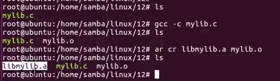
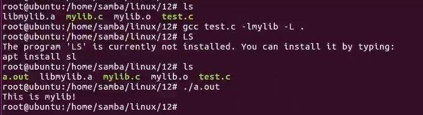
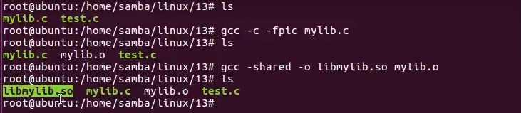
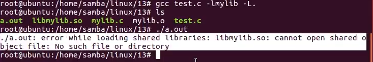
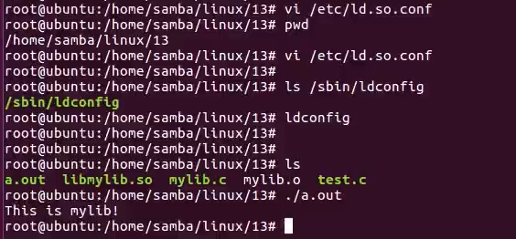

# 库
## 3.Linux下库的种类
### 静态库:
静态库在程序编译的时候会被链接到目标代码里面。所以我们的程序运行就不在需要该静态库了。因此编译出来的体积就比较大。静态库以lib开头，以.a结尾。
### 动态库:(动态库也叫共享库)
动态库在程序编译的时候不会被链接到目标代码里面，而是在程序运行的时候被载入的，所以我们的程序运行就需要该动态库了。因此编译出来的体积就比较小。动态库以lib开头，以.so结尾。
### 静态库制作步骤
<1>编写或准备库的源代码将源码
<2>使用gcc文件编译生成.o文件
<3>使用ar命令创建静态库
<4>测试库文件


测试库文件
如果我们的程序代码用到了库文件里面的函数，我们在编译的时候需要链接库。系统默认会在/ib或者/usr/ib去找库文件。或者在编译的时候我们制定库的路径。
举例:
```bash
gcc test.c -lmylib -L
-:指定静态库的库名
-L:指定静态库的查找位置。-L.表示在当前目录下去查找
```

## 4.动态库的制作步骤
<1>编写或准备库的源代码将源码
<2>使用gcc文件编译生成.o文件
<3>使用gcc命令创建动态库
<4>测试库文件

如果我们的程序代码用到了库文件里面的函数，我们在编译的时候需要链接库。系统默认会在/ib或者/usr/ib去找库文件。或者在编译的时候我们制定库的路径。
举例:
```bash
gcc test.c -lmylib -L
```
-l:指定动态库的库名
-L:指定动态库的查找位置。-L.表示在当前目录下去查找



