# 1.什么是进程?
进程指的是正在运行的程序

# 2.进程ID
每个进程都有一个唯一的标识符，简称pid既进程ID，

# 3.进程间的通信的几种方法?
管道通信:有名管道，无名管道
信号通信:信号的发送，信号的接受，信号的处理
IPC通信:共享内存，消息队列，信号灯
Socket通信
进程之间的通信不是通过应用层，而是Linux内核层面的通信
用的是文件IO不是标准IO
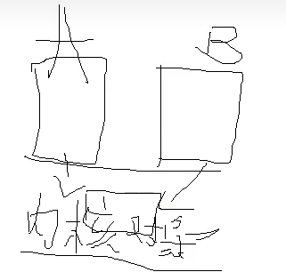

# 3.进程的三种基本状态以及转换
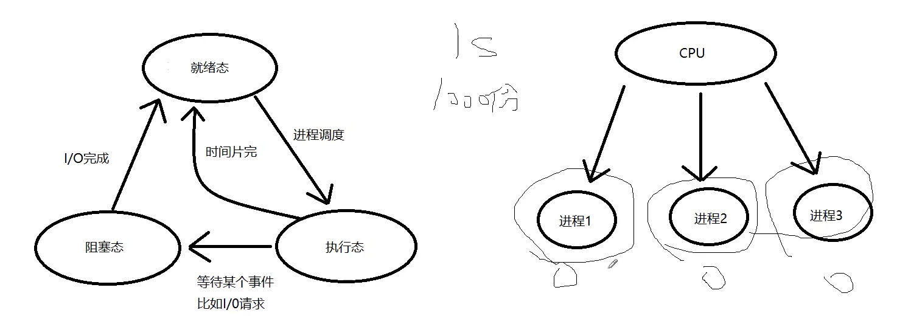
# 创建进程函数
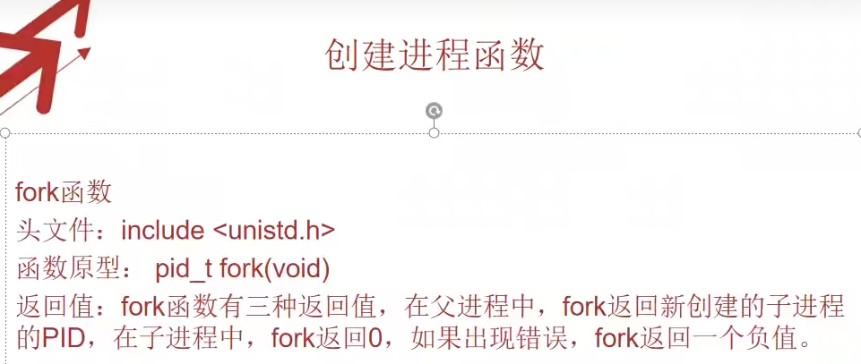
函数:
getpid():获得当前进程的PID。
getppid():获得当前进程的父进程的PID.
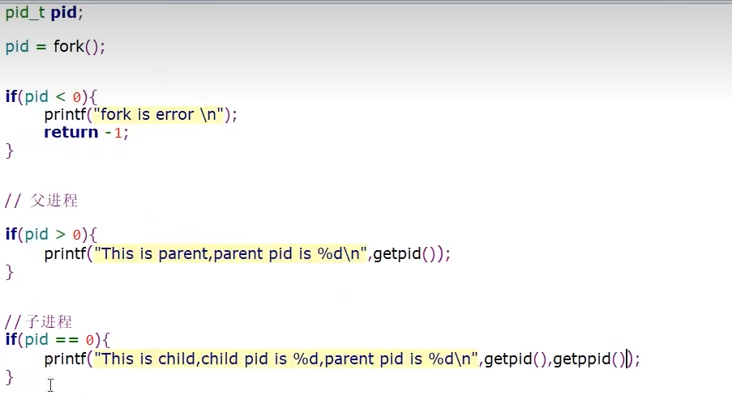

# 进程执行顺序    
父子进程的执行顺序是不确定的
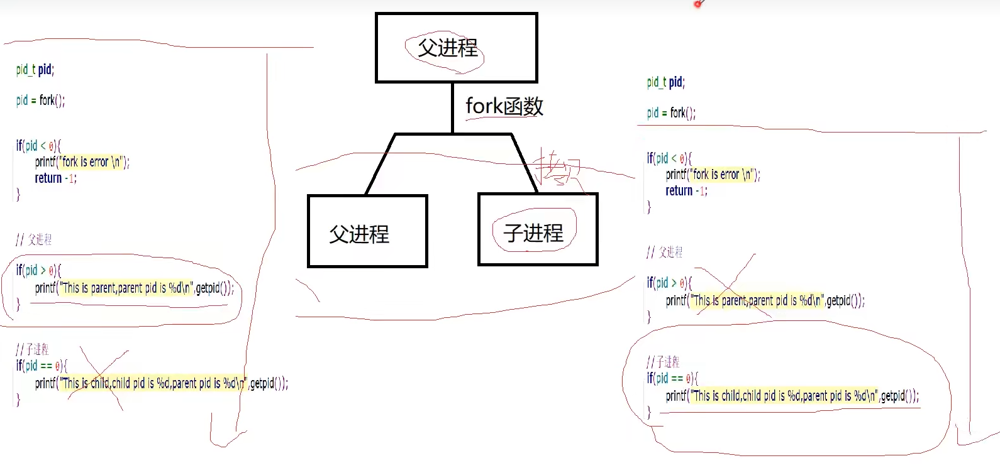
# ececl函数
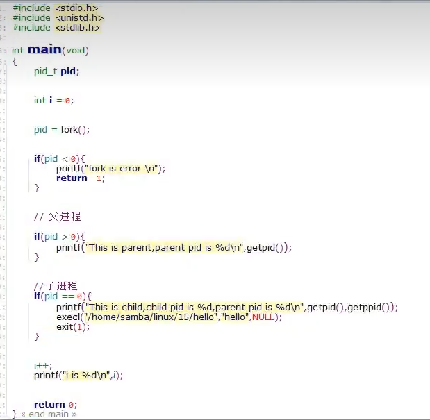
# ps和kill函数
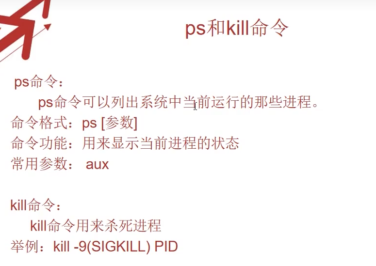

# 守护进程
1. 什么是守护进程？
守护进程运行在后台，不跟任何控制终端关联。

2. 怎么创建一个守护进程？
有两个基本要求:
1.必须作为我们init进程的子进程，
2.不跟控制终端交互。

3. 步骤
1.使用fork函数创建一个新的进程，然后让父进程使用exit函数直接退出(必须)
2.调用setsid函数。(必须)
3.调用chdir函数，将当前的工作目录改为根目录，增强程序的健壮性。(不是必要的)
4.重设我们的umask文件掩码，增强程序的健壮性和灵活性(不是必要的)
5.关闭文件描述符，节省资源(不是必要的)
6.执行我们需要执行的代码(必要的)

# 管道通信
1  无名管道（只能实现有亲缘关系的进程通信）
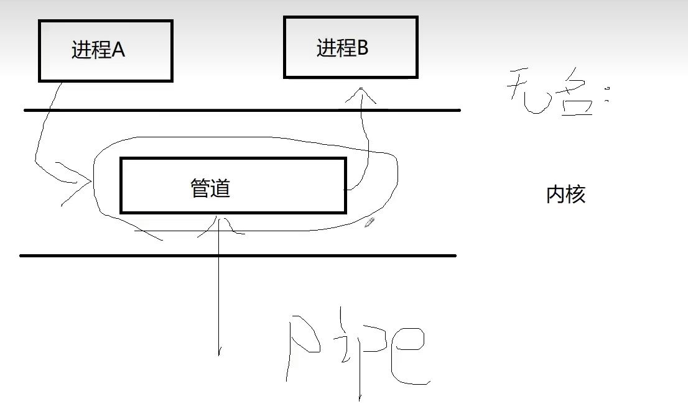
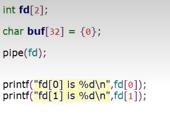
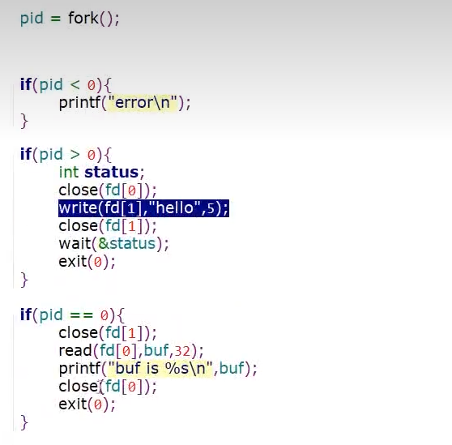

2  有名管道
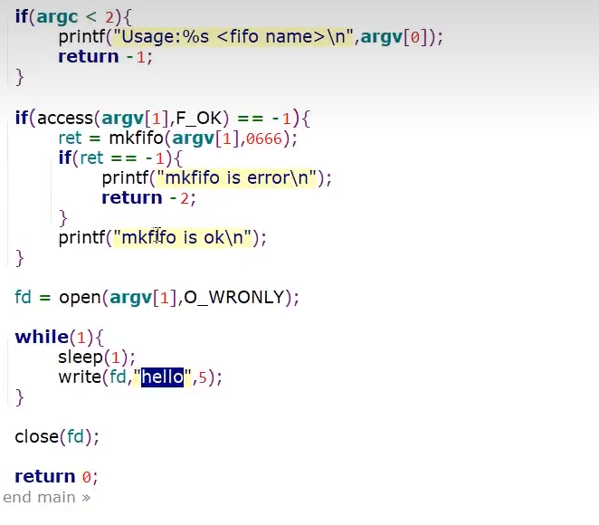
