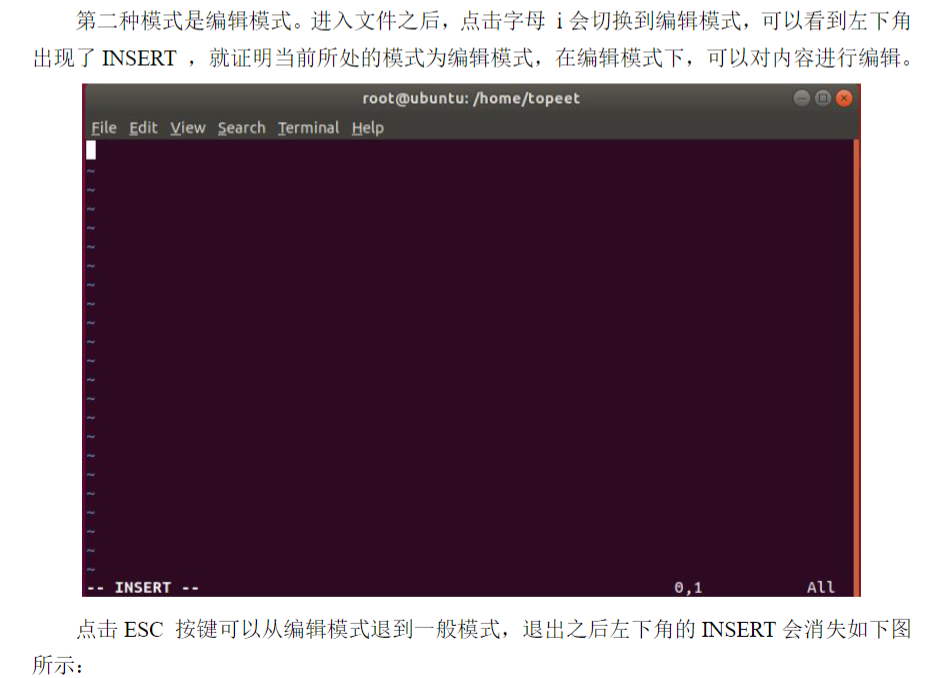
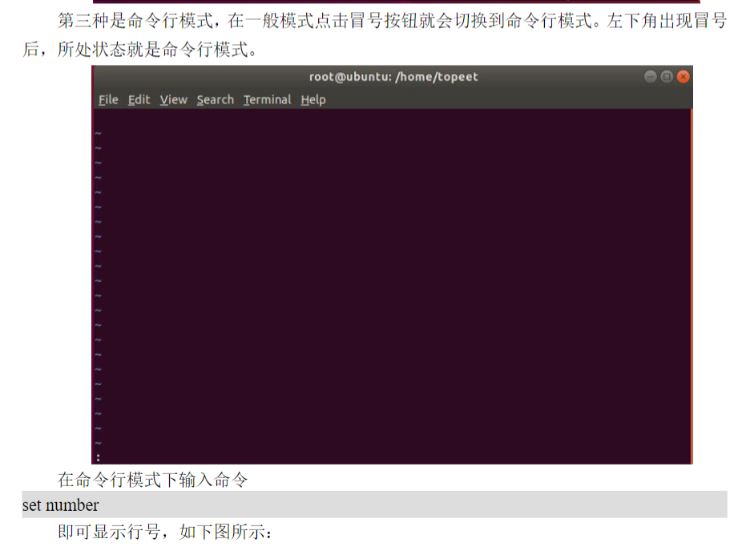
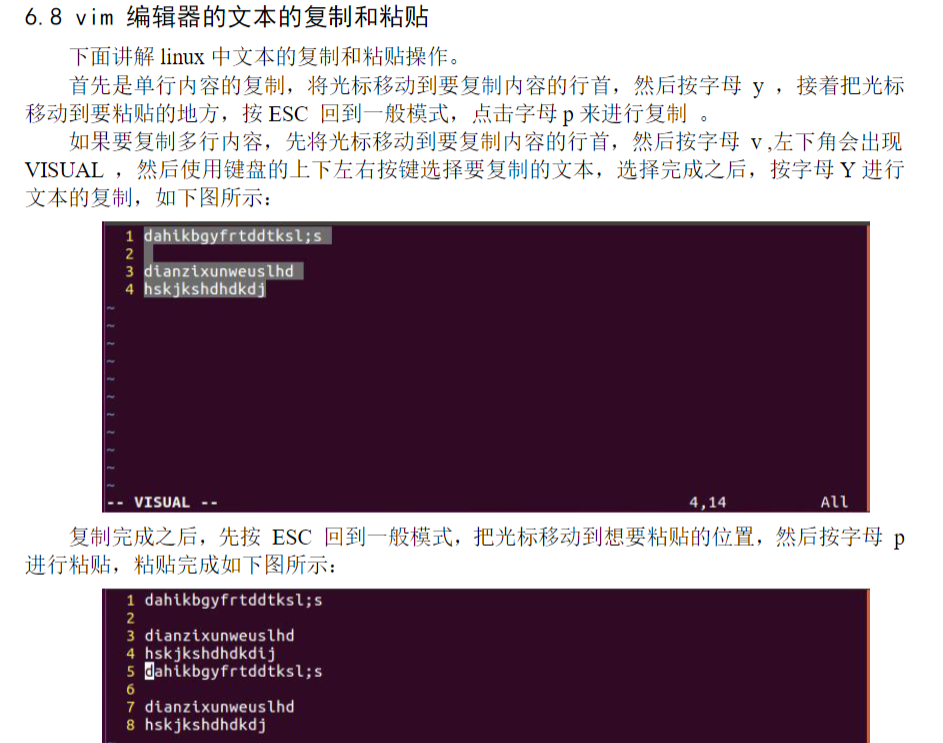
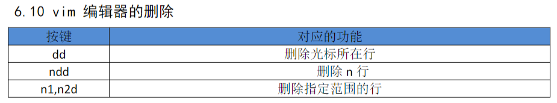
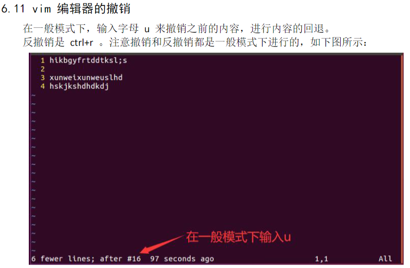
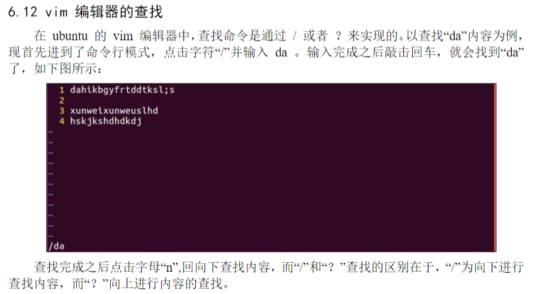
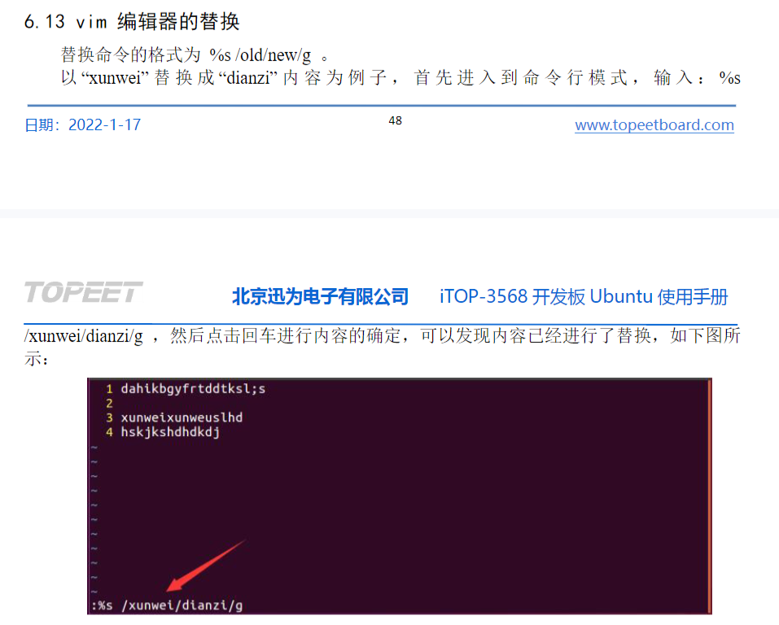
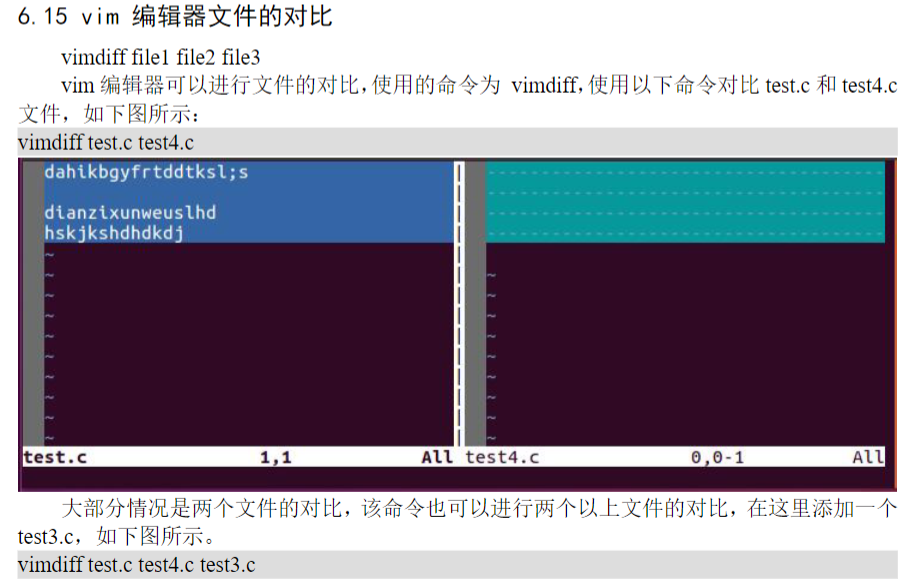
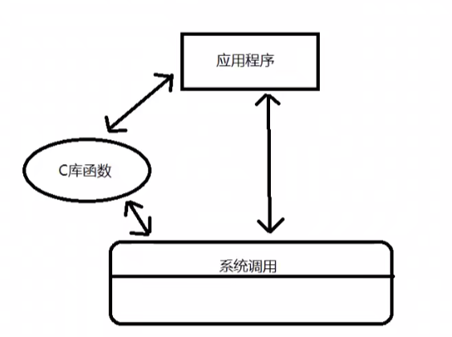

# Ubuntu修改root用户密码

```
sudo passwd root
```
# 打开终端
方法如下所示：
1.快捷键Ctrl+Alt+t组合按键；
2.在Ubuntu系统桌面，鼠标右键然后选择“OpeninTerminal”

# 命令行的组成:
1 当前操作用户topeet:
Ubuntu:代表主机名
~:当前目录名
S:代表不是root用户
#:代表是root用户

2 为什么要启用 root 用户?
我们使用 Ubuntu 系统主要用来做嵌入式开发，不是linux运维，没有必要对root用户过于敏感。
系统的权限都要为我们嵌入式开发人员打开。

3 启用 root 用户步骤
步骤一:（可选）
使用 sudo passwd
然后输入密码
步骤二:
su root
输入 root 密码

rootaubuntu:/home/topeet#

如果启动成功，则显示当前的用户为root 而不是topeet 退出 root 用户使用 exit 命令。

# 更新下载源

```
sudo apt-get update
使用apt-get update命令更新下载源
1,Ubuntu必须可以上网
可以打开浏览器试一下
2，设置下载源
系统设置里面设置
3，更新下载源（在root用户下）
apt-get update
4，检查依赖是否有损坏
apt-get check
5，安装vim软件（在root用户下）
apt-get install vim
6,软件更新

更新全部
apt-get upgrade
更新vim
apt-get upgrade vim

7，卸载软件
apt-get remove vim
```
## 编译模式



## 复制粘贴


## 删除


## 撤销与反撤销

## 查找

## 替换

## 对比

## 标准IO和文件IO



