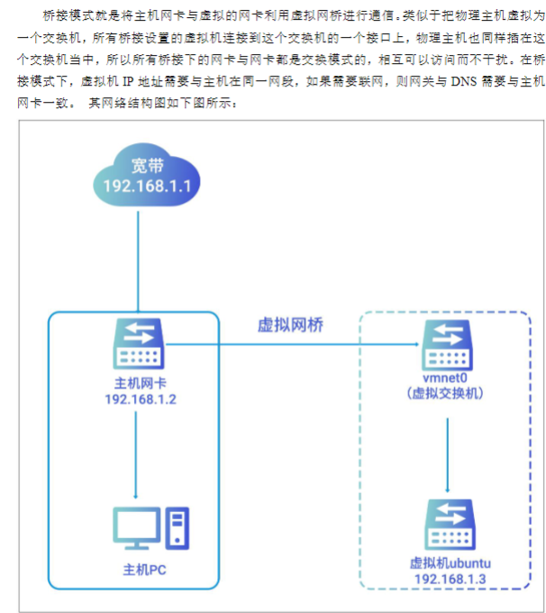
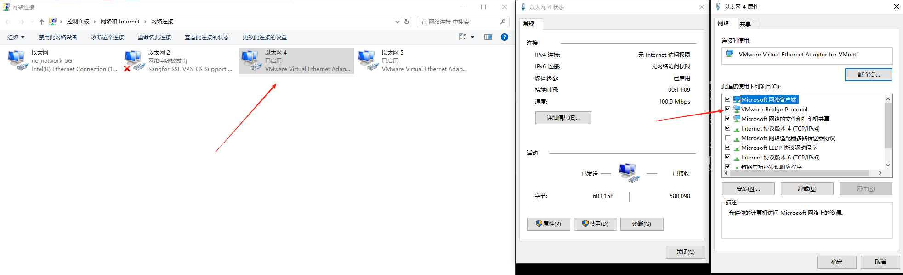
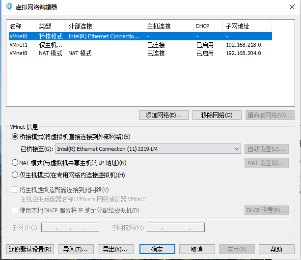
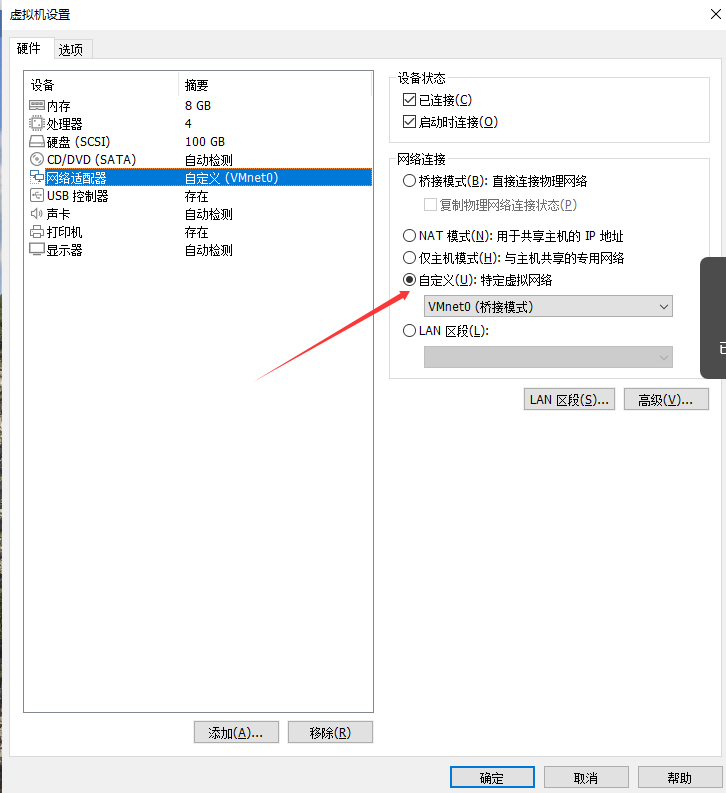
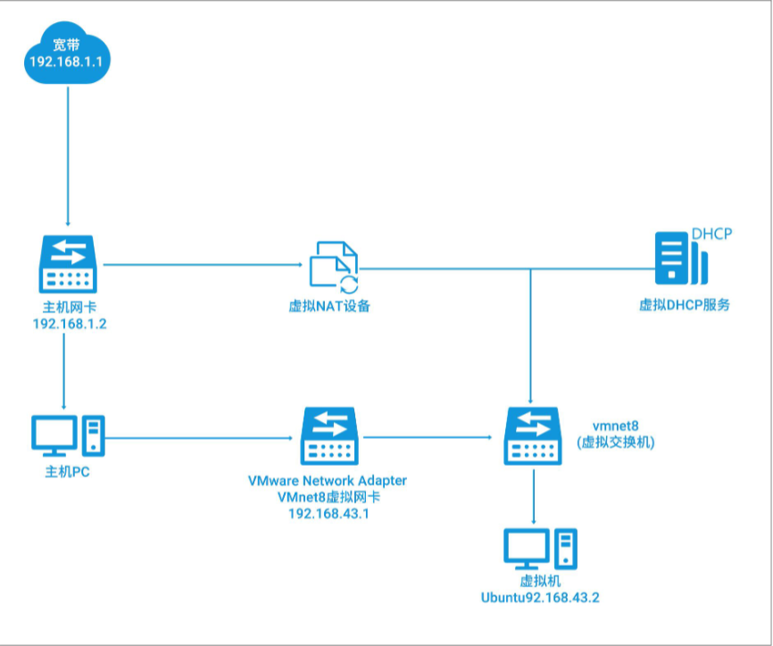

# Ubuntu/网络的三种模式.md

## 桥接模式

在开始前需要打开如下的命令

然后如果是主机有多个网卡（有线，无线等）在Vmware中的设置里面，可以选择一个网卡做为桥接的网卡(尽量不要自动，可能自动会有问题)
，
然后在网卡的设置里面选择桥接，再选择需要连接的网卡(这里也是选下面的，防止找错网卡)，

这样就可以在虚拟机里面使用了

## NAT模式
在 NAT 网络中，会使用到 VMnet8 虚拟交换机，主机上的 VMware Network Adapter VMnet8
虚拟网卡被连接到 VMnet8 交换机上，来与虚拟机进行通信，但是 VMware Network Adapter
VMnet8 虚拟网卡仅仅是用于和 VMnet8 网段通信用的，它并不为 VMnet8 网段提供路由功能，
处于虚拟 NAT 网络下的虚拟机是使用虚拟的 NAT 服务器连接的 Internet 的。其网络结构图如
下图所示

NAT 模式可以让虚拟机能借用主机的网络访问 Internet，但是无法访问本地网络（局域网），因为 NAT 服务器是不知道本地网络的。适用于只需要上网，不需要被访问的情况。