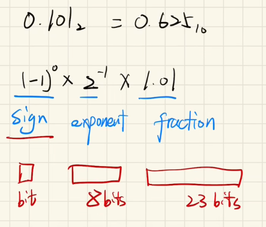
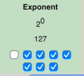

0.101的二进制  == 0.625的十进制

用科学计数法表示就是 

其中fracxtion中的第一个1不存，所以1.01表示为010000000
# 符号位sign
其中符号位0表示正数
1表示负数

# exponent
由八位组成
其中2的0次方为127 也就是01111111

2的负一次方为126       01111110
2的一次方为128    也就是10000000
# fraction
这个就是1.M，然后看上面几次方就移动几位小数点，转化为十进制

eg:413600的16进制

0100  0001  0011  0110  0000  0000  0000  0000

符号位0 
后面数八位 100 0001 0 = 130 - 127 = 3
后面23位 011  0110  0000  0000  0000  0000
1.011 011 移动3位 = 1011.0110 = 11.375