# Git 主要命令


[可视化工具](https://learngitbranching.js.org/?locale=zh_CN&NODEMO=)

循序渐进地介绍 Git 主要命令

### git commit -m "注释"
提交代码，并添加注释
Git 仓库中的提交记录保存的是你的目录下所有文件的快照，就像是把整个目录复制，然后再粘贴一样，但比复制粘贴优雅许多！

Git 希望提交记录尽可能地轻量，因此在你每次进行提交时，它并不会盲目地复制整个目录。条件允许的情况下，它会将当前版本与仓库中的上一个版本进行对比，并把所有的差异打包到一起作为一个提交记录。

Git 还保存了提交的历史记录。这也是为什么大多数提交记录的上面都有 parent 节点的原因 —— 我们会在图示中用箭头来表示这种关系。对于项目组的成员来说，维护提交历史对大家都有好处。
<div align="center">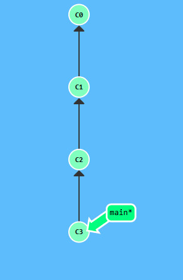</div>

### git branch
Git 的分支也非常轻量。它们只是简单地指向某个提交记录 —— 仅此而已。所以许多 Git 爱好者传颂：

早建分支！多用分支！
这是因为即使创建再多的分支也不会造成储存或内存上的开销，并且按逻辑分解工作到不同的分支要比维护那些特别臃肿的分支简单多了。
```bash
git branch <your-branch-name>
```
<div align="center">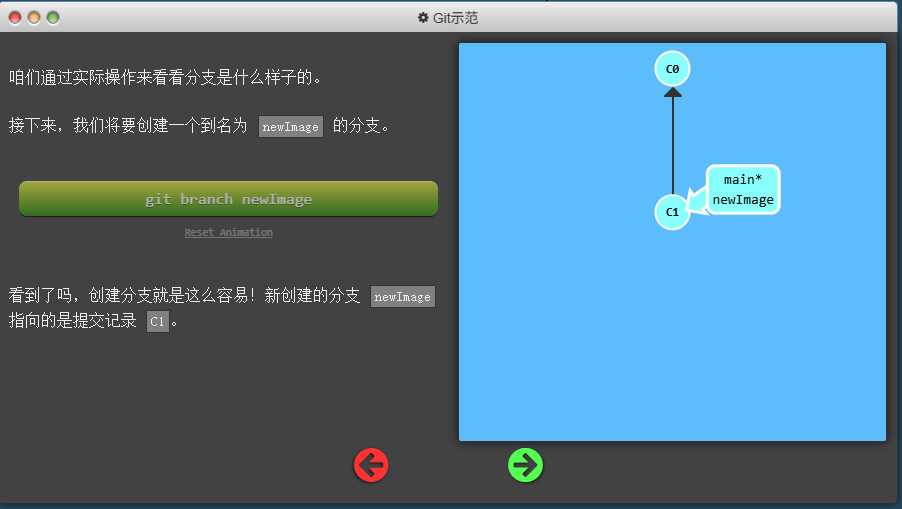</div>
这个时候你再提交代码

```bash
git commit 
```
<div align="center">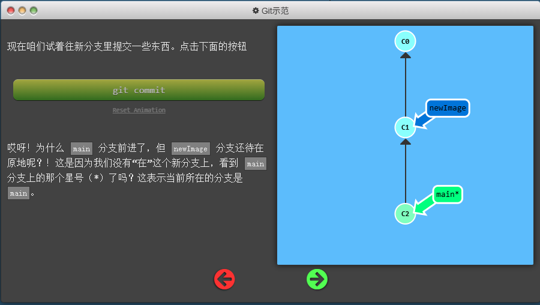</div>

```bash
git checkout <your-branch-name>
```
<div align="center">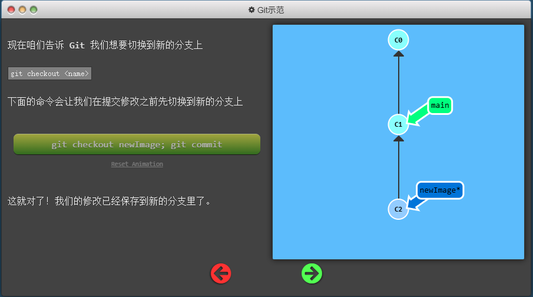</div>

```
git checkout -b <your-branch-name>
```
<div align="center">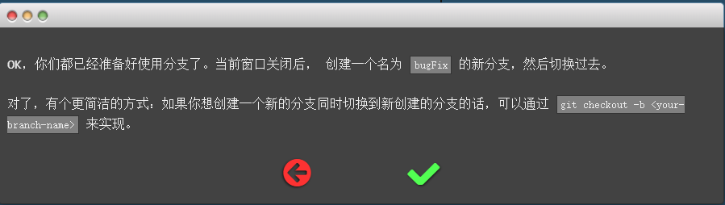</div>

### git merge
合并分支
接下来咱们看看如何将两个分支合并到一起。就是说我们新建一个分支，在其上开发某个新功能，开发完成后再合并回主线。

咱们先来看一下第一种方法 —— git merge。在 Git 中合并两个分支时会产生一个特殊的提交记录，它有两个 parent 节点。翻译成自然语言相当于：“我要把这两个 parent 节点本身及它们所有的祖先都包含进来。”
在下图中，bugFix 分支包含了一个新提交，而 master 分支没有任何新的提交。我们现在要把 bugFix 分支合并到 master 分支上。

首先在 master 分支上执行以下命令：
```bash
git merge bugFix
```
<div align="center">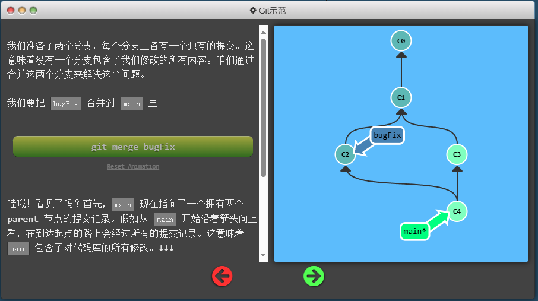</div>
咱们再把 main 分支合并到 bugFix：

```bash
git checkout bugFix
git merge main
```
<div align="center">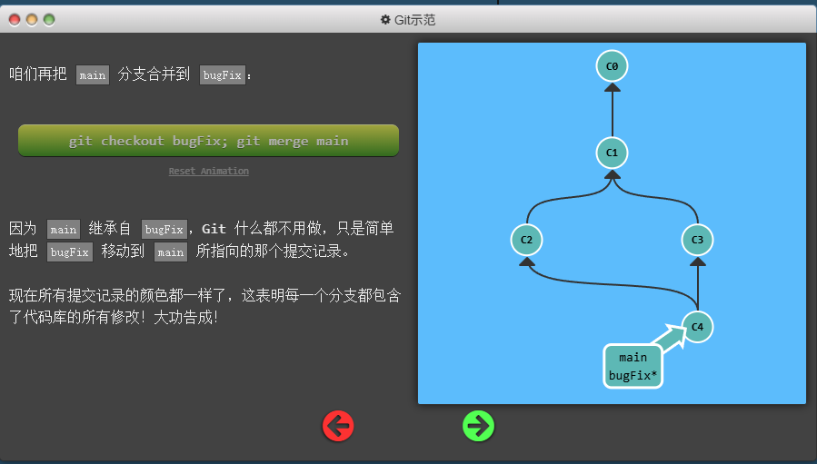</div>

### git rebase
另一种合并分支的方法是使用 git rebase 命令。它的工作原理是将一个分支的所有提交“搬移”到另一个分支的最前端。它的工作方式与 git merge 有所不同。
假设我们现在在 bugFix 分支上，并且想把 main 分支合并进来。我们可以执行以下命令：
<div align="center">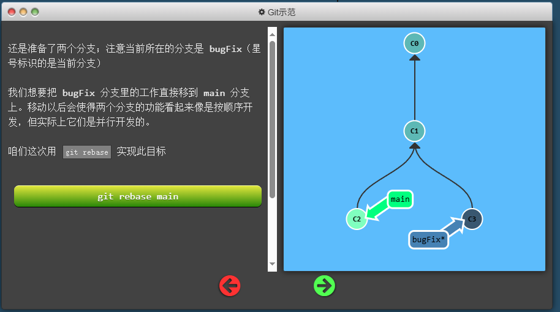</div>

在bugFix 分支上执行以下命令：
```bash
git rebase main
```
<div align="center">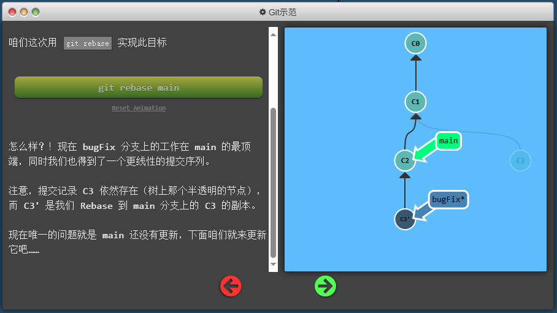</div>
现在我们切换回 main 分支，并将 bugFix 分支合并进来：

```bash
git checkout main
git rebase bugFix
``` 
<div align="center">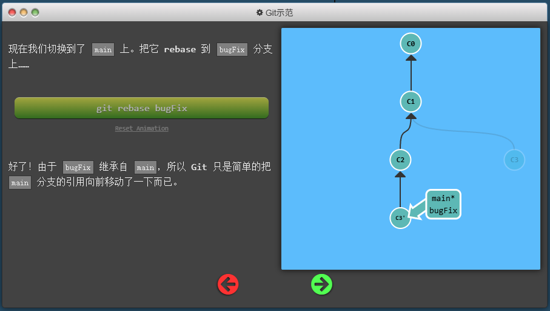</div>

### HEAD
HEAD 是一个指向当前分支的引用。它就像是一个指针，告诉 Git 你现在正在查看哪个分支。
当你切换分支时，HEAD 会自动更新以指向新的分支。例如，当你从 main 分支切换到 feature 分支时，HEAD 会从指向 main 分支的最新提交变为指向 feature 分支的最新提交。
```bash
git checkout <branch-name>
```
HEAD 还可以指向一个具体的提交，而不是分支。这种情况下，HEAD 被称为“分离状态”（detached HEAD）。在这种状态下，你可以查看和修改代码，但如果你进行新的提交，这些提交不会被任何分支引用，可能会导致丢失。
```bash
git checkout <commit-hash>
```
<div align="center">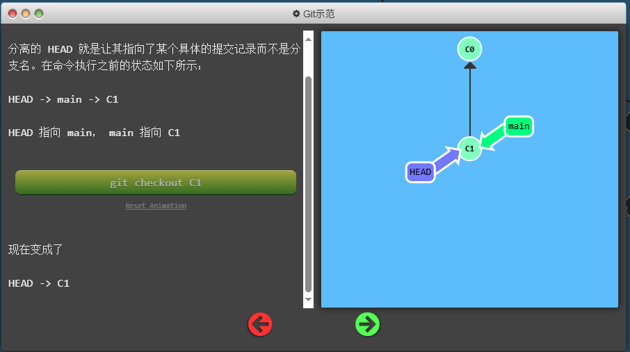</div>

### 相对引用
Git 允许你使用相对引用来简化对提交的引用。相对引用使用符号 `~` 和 `^` 来表示相对于当前 HEAD 的位置。
- `HEAD~n`：表示从当前 HEAD 向上追溯 n 个提交。例如，`HEAD~1` 是当前提交的父提交，`HEAD~2` 是父提交的父提交，以此类推。
- `HEAD^`：表示当前提交的第一个父提交。如果当前提交有多个父提交（例如在合并提交中），你可以使用 `HEAD^2` 来引用第二个父提交。
```bashgit checkout HEAD~1
git checkout main^
```
<div align="center">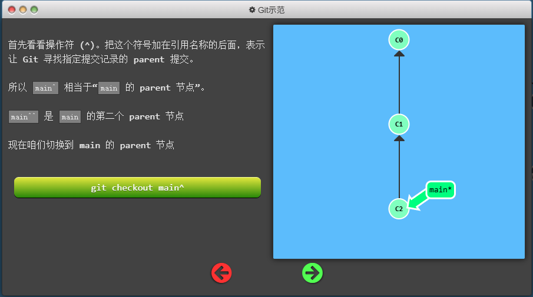</div>
<div align="center">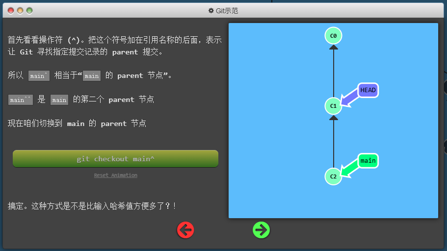</div>

```bash
git checkout C3
git checkout HEAD^
git checkout HEAD^
git checkout HEAD^
```
<div align="center">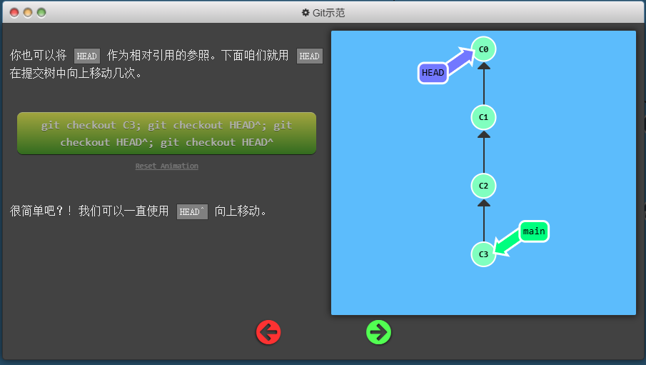</div>

```bash
git checkout HEAD~3
```
<div align="center">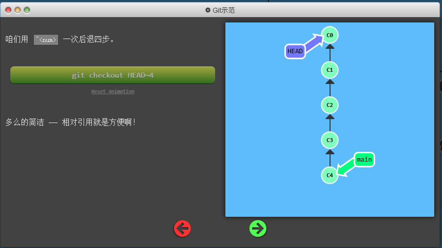</div>

强制修改分支位置
```bash
git branch -f main HEAD~3
```
我使用相对引用最多的就是移动分支。可以直接使用 -f 选项让分支指向另一个提交。
上面的命令会将 main 分支强制指向 HEAD 的第 3 级 parent 提交。
<div align="center">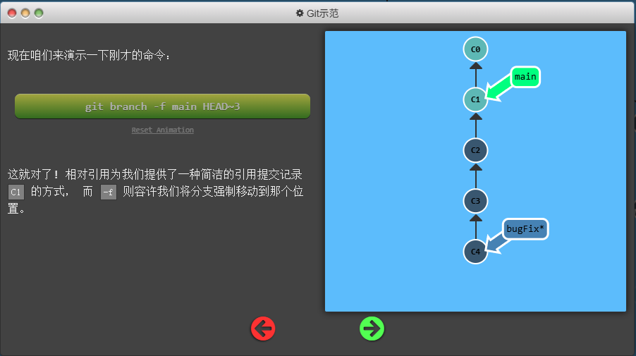</div>

### 撤销变更
在 Git 里撤销变更的方法很多。和提交一样，撤销变更由底层部分（暂存区的独立文件或者片段）和上层部分（变更到底是通过哪种方式被撤销的）组成。我们这个应用主要关注的是后者。

主要有两种方法用来撤销变更 —— 一是 git reset，还有就是 git revert。接下来咱们逐个进行讲解。
#### git reset
`git reset` 命令用于重置当前分支的 HEAD 到指定的提交。它有三种主要模式：--soft、--mixed 和 --hard。
- `--soft`：仅重置 HEAD 指针，不修改工作目录和暂存区。这意味着所有更改仍然保留在暂存区中，准备好进行新的提交。
- `--mixed`（默认模式）：重置 HEAD 指针并更新暂存区，但不修改工作目录。更改会从暂存区中移除，但仍然保留在工作目录中。
- `--hard`：重置 HEAD 指针、暂存区和工作目录。 这会丢弃所有未提交的更改，恢复到指定提交的状态。
```bash
git reset --soft <commit-hash>
git reset --mixed <commit-hash>
git reset --hard <commit-hash>
``` 
<div align="center">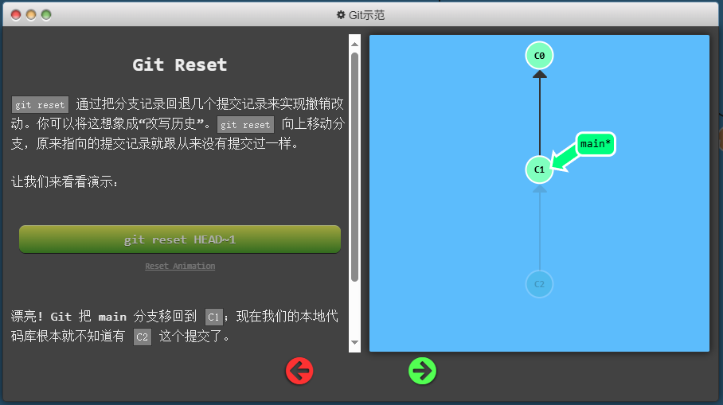</div>
（译者注：在reset后， C2 所做的变更还在，但是处于未加入暂存区状态。）

#### git revert
虽然在你的本地分支中使用 git reset 很方便，但是这种“改写历史”的方法对大家一起使用的远程分支是无效的哦！

`git revert` 命令用于创建一个新的提交，该提交会撤销指定提交所做的更改。与 `git reset` 不同，`git revert` 不会修改提交历史，因此它是一个更安全的选择，尤其是在公共分支上工作时。
```bash 
git revert <commit-hash>
```
<div align="center">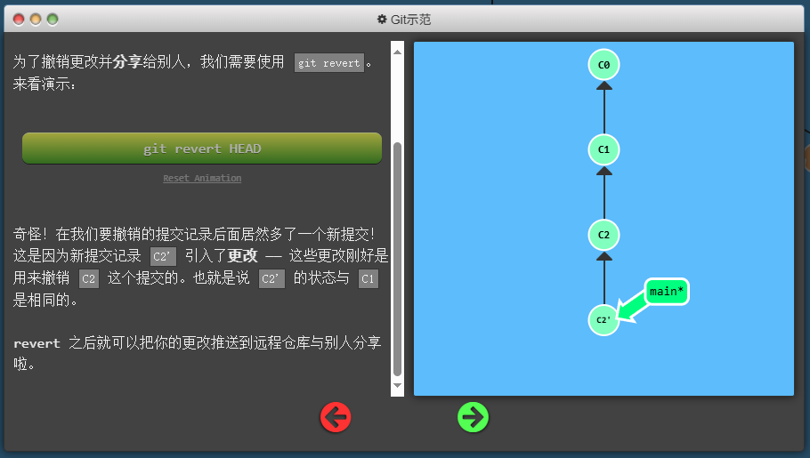</div>