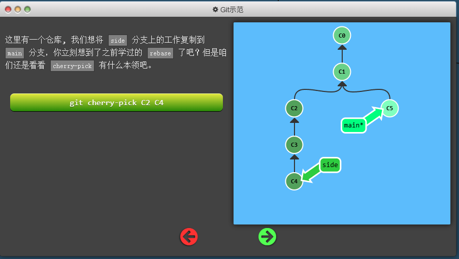
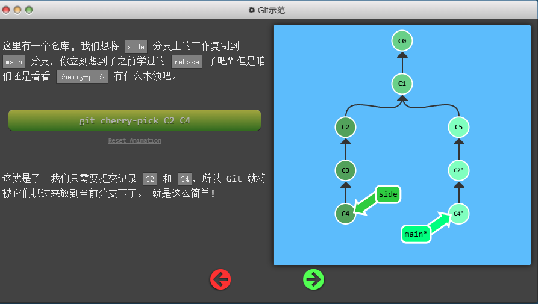
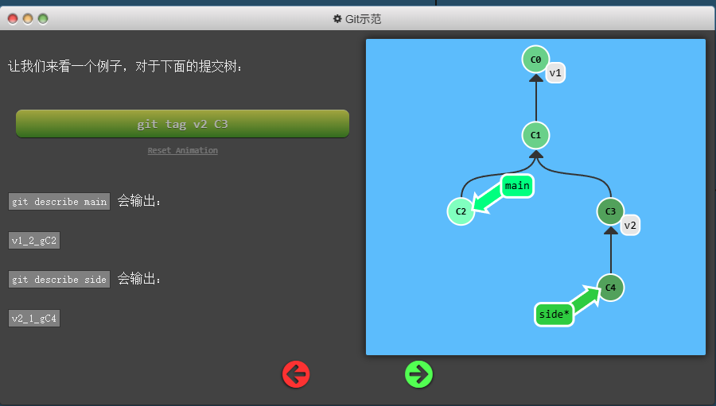

# 自由修改提交树
Git 提供了强大的工具来修改提交树，使得我们可以在不影响项目历史的情况下进行调整。以下是一些常用的方法：

## 整体提交记录
本系列的第一个命令是 git cherry-pick, 命令形式为:
```bash
git cherry-pick <提交号>...
```
如果你想将一些提交复制到当前所在的位置（HEAD）下面的话， Cherry-pick 是最直接的方式了。我个人非常喜欢 cherry-pick，因为它特别简单易用。它的工作原理是将指定的提交复制到当前分支的 HEAD 位置。这样，你可以轻松地将某些提交应用到不同的分支上，而不需要手动复制代码。

<div align="center"></div>

```bash
git cherry-pick C2 C4
```
<div align="center"></div>

## 交互式的rebase
交互式 rebase 是 Git 中一个非常强大的工具，它允许你在修改提交历史时进行更细粒度的控制。通过交互式 rebase，你可以重新排序、编辑、合并或删除提交，从而使提交历史更加清晰和有意义。
当你知道你所需要的提交记录（并且还知道这些提交记录的哈希值）时, 用 cherry-pick 再好不过了 —— 没有比这更简单的方式了。

但是如果你不清楚你想要的提交记录的哈希值呢? 幸好 Git 帮你想到了这一点, 我们可以利用交互式的 rebase —— 如果你想从一系列的提交记录中找到想要的记录, 这就是最好的方法了

交互式 rebase 指的是使用带参数 --interactive 的 rebase 命令, 简写为 -i
如果你在命令后增加了这个选项, Git 会打开一个 UI 界面并列出将要被复制到目标分支的备选提交记录，它还会显示每个提交记录的哈希值和提交说明，提交说明有助于你理解这个提交进行了哪些更改。

在实际使用时，所谓的 UI 窗口一般会在文本编辑器 —— 如 Vim —— 中打开一个文件。 考虑到课程的初衷，我弄了一个对话框来模拟这些操作
```Bash
git rebase -i <目标分支>
```
当 rebase UI界面打开时, 你能做3件事:

1. 调整提交记录的顺序（通过鼠标拖放来完成）
2. 删除你不想要的提交（通过切换 pick 的状态来完成，关闭就意味着你不想要这个提交记录）
3. 合并提交。 遗憾的是由于某种逻辑的原因，我们的课程不支持此功能，因此我不会详细介绍这个操作。简而言之，它允许你把多个提交记录合并成一个。

## 杂项
### 本地栈式提交
来看一个在开发中经常会遇到的情况：我正在解决某个特别棘手的 Bug，为了便于调试而在代码中添加了一些调试命令并向控制台打印了一些信息。

这些调试和打印语句都在它们各自的提交记录里。最后我终于找到了造成这个 Bug 的根本原因，解决掉以后觉得沾沾自喜！

最后就差把 bugFix 分支里的工作合并回 main 分支了。你可以选择通过 fast-forward 快速合并到 main 分支上，但这样的话 main 分支就会包含我这些调试语句了。你肯定不想这样，应该还有更好的方式……

### git Tags
Git 标签（Tags）是用于给特定的提交打上标记的工具，通常用于标记重要的版本或里程碑。标签可以帮助你快速定位到某个特定的提交，方便版本管理和发布。
Git 支持两种类型的标签：轻量标签（Lightweight Tags）和附注标签（Annotated Tags）。
它们可以（在某种程度上 —— 因为标签可以被删除后重新在另外一个位置创建同名的标签）永久地将某个特定的提交命名为里程碑，然后就可以像分支一样引用了。

更难得的是，它们并不会随着新的提交而移动。你也不能切换到某个标签上面进行修改提交，它就像是提交树上的一个锚点，标识了某个特定的位置。

咱们来看看标签到底是什么样。
<div align="center"></div>

### git Describe
Git describe 是一个非常有用的命令，它可以帮助你生成一个易于理解的版本标识符，基于最近的标签和当前提交之间的距离。这个命令特别适合在发布版本时使用，因为它能够提供关于代码状态的有用信息。
```bash
git describe [选项] [<提交>]
```
<div align="center"></div>

##多分支协作