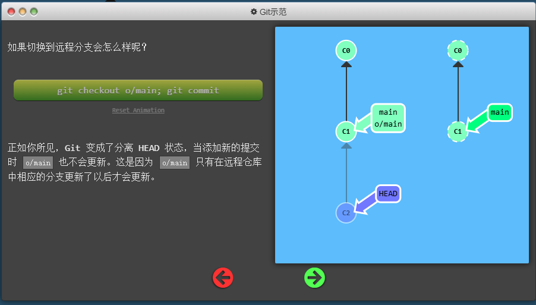
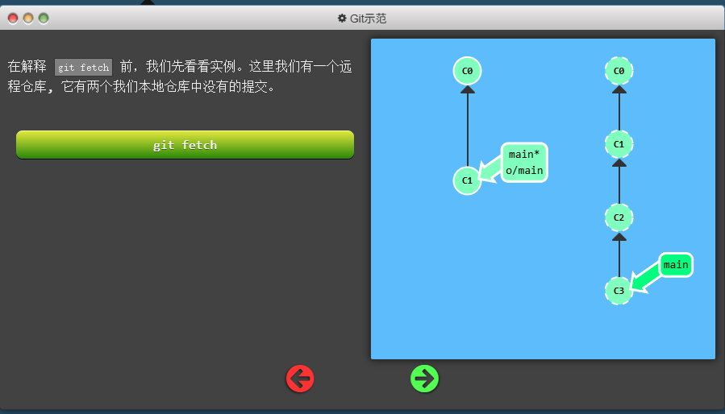
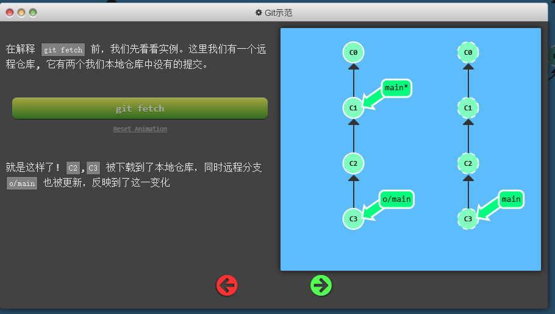
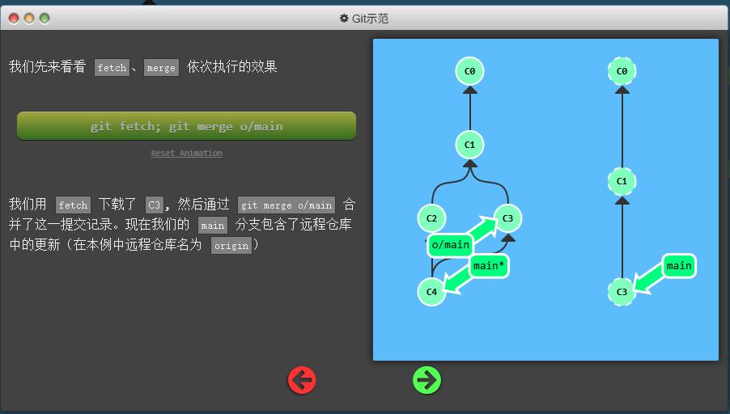
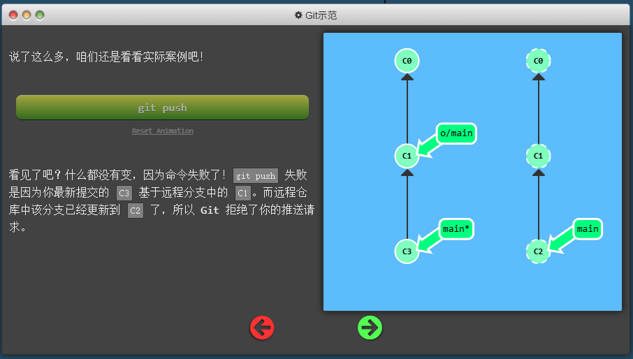
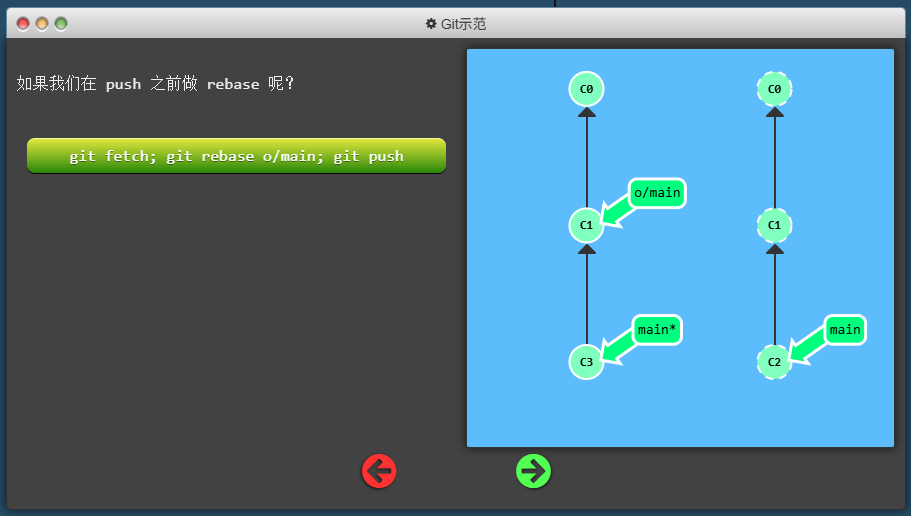
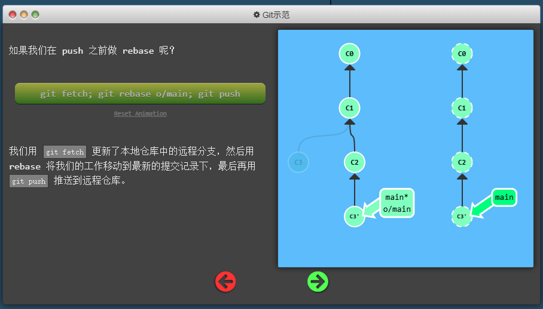
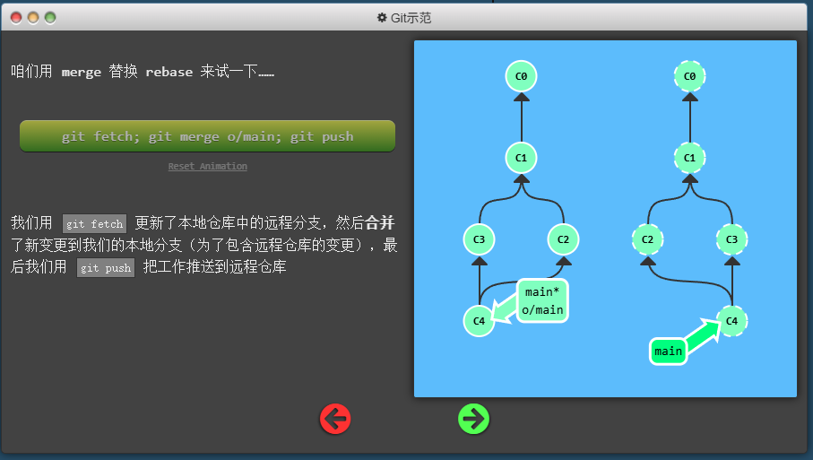
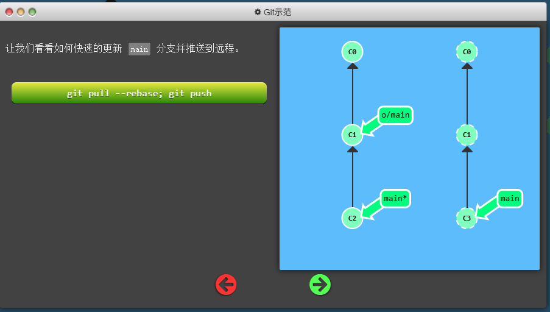
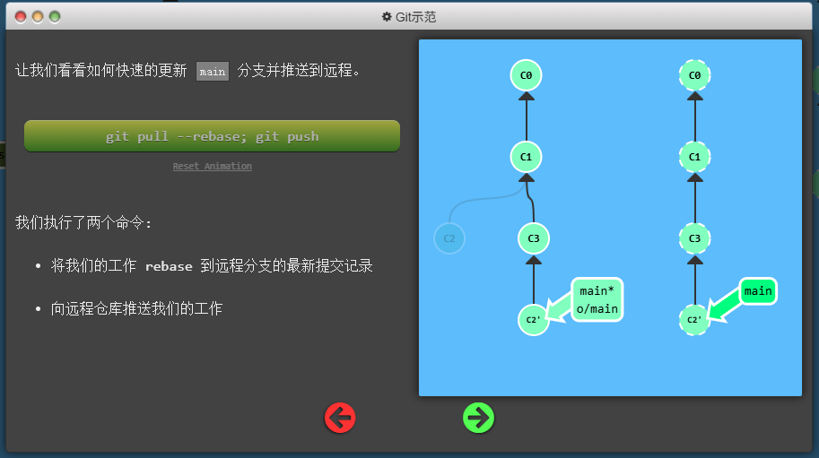

# 远程

## 远程分支
既然你已经看过 git clone 命令了，咱们深入地看一下发生了什么。

你可能注意到的第一个事就是在我们的本地仓库多了一个名为 o/main 的分支, 这种类型的分支就叫远程分支。由于远程分支的特性导致其拥有一些特殊属性。

远程分支反映了远程仓库(在你上次和它通信时)的状态。这会有助于你理解本地的工作与公共工作的差别 —— 这是你与别人分享工作成果前至关重要的一步.

远程分支有一个特别的属性，在你切换到远程分支时，自动进入分离 HEAD 状态。Git 这么做是出于不能直接在这些分支上进行操作的原因, 你必须在别的地方完成你的工作, （更新了远程分支之后）再用远程分享你的工作成果。
<div align="center"></div>

## git fetch
Git fetch 命令用于从远程仓库获取最新的更新，并将这些更新下载到本地仓库中，但不会自动合并这些更新到当前分支。它允许你查看远程仓库的状态，并决定何时以及如何将这些更改合并到你的工作中。


在解释 git fetch 前，我们先看看实例。这里我们有一个远程仓库, 它有两个我们本地仓库中没有的提交。
```bash
git fetch [远程名] [分支名]
```
<div align="center"></div>

```bash
git fetch 
```
<div align="center"></div>

### git fetch 做了些什么
git fetch 完成了仅有的但是很重要的两步:

从远程仓库下载本地仓库中缺失的提交记录
更新远程分支指针(如 o/main)
git fetch 实际上将本地仓库中的远程分支更新成了远程仓库相应分支最新的状态。

如果你还记得上一节课程中我们说过的，远程分支反映了远程仓库在你最后一次与它通信时的状态，git fetch 就是你与远程仓库通信的方式了！希望我说的够明白了，你已经了解 git fetch 与远程分支之间的关系了吧。

git fetch 通常通过互联网（使用 http:// 或 git:// 协议) 与远程仓库通信。

### git fetch 不会做的事
git fetch 并不会改变你本地仓库的状态。它不会更新你的 main 分支，也不会修改你磁盘上的文件。

理解这一点很重要，因为许多开发人员误以为执行了 git fetch 以后，他们本地仓库就与远程仓库同步了。它可能已经将进行这一操作所需的所有数据都下载了下来，但是并没有修改你本地的文件。我们在后面的课程中将会讲解能完成该操作的命令 :D

所以, 你可以将 git fetch 的理解为单纯的下载操作。

## git pull
Git pull 命令用于从远程仓库获取最新的更新，并将这些更新自动合并到当前分支。它实际上是 git fetch 和 git merge 两个命令的组合，简化了从远程仓库获取和合并更改的过程。

```bash
git pull [远程名] [分支名]
```
当你执行 git pull 时，Git 会先执行 git fetch，从远程仓库下载最新的提交记录，然后自动将这些更改合并到你当前所在的分支。如果在合并过程中没有冲突，Git 会自动完成合并操作；如果有冲突，你需要手动解决这些冲突，然后提交合并结果。

我们先来看看 fetch、merge 依次执行的效果
<div align="center"></div>

```bash
git fetch
git merge o/main
```

<div align="center"></div>

```bash
git pull
```
<div align="center"></div>

## git push
Git push 命令用于将本地仓库中的提交记录上传到远程仓库。它允许你与其他开发人员共享你的工作成果，并将本地的更改同步到远程仓库中。

```bash
git push [远程名] [分支名]
```

## 偏离的工作
假设你周一克隆了一个仓库，然后开始研发某个新功能。到周五时，你新功能开发测试完毕，可以发布了。但是 —— 天啊！你的同事这周写了一堆代码，还改了许多你的功能中使用的 API，这些变动会导致你新开发的功能变得不可用。但是他们已经将那些提交推送到远程仓库了，因此你的工作就变成了基于项目旧版的代码，与远程仓库最新的代码不匹配了。

这种情况下, git push 就不知道该如何操作了。如果你执行 git push，Git 应该让远程仓库回到星期一那天的状态吗？还是直接在新代码的基础上添加你的代码，亦或由于你的提交已经过时而直接忽略你的提交？

因为这情况（历史偏离）有许多的不确定性，Git 是不会允许你 push 变更的。实际上它会强制你先合并远程最新的代码，然后才能分享你的工作。

<div align="center"></div>

<div align="center"></div>

```bash
git fetch 
git rebase o/main
git push
```
<div align="center"></div>

```bash
git fetch 
git merge o/main
git push
```
<div align="center"></div>

## 合并特性分支
既然你应该很熟悉 fetch、pull、push 了，现在我们要通过一个新的工作流来测试你的这些技能。

在大型项目中开发人员通常会在（从 main 上分出来的）特性分支上工作，工作完成后只做一次集成。这跟前面课程的描述很相像（把 side 分支推送到远程仓库），不过本节我们会深入一些.

但是有些开发人员只在 main 上做 push、pull —— 这样的话 main 总是最新的，始终与远程分支 (o/main) 保持一致。

对于接下来这个工作流，我们集成了两个步骤：

将特性分支集成到 main 上
推送并更新远程分支
<div align="center"></div>

```bash
git pull --rebase 
git push
```
<div align="center"></div>

## git push  的参数
